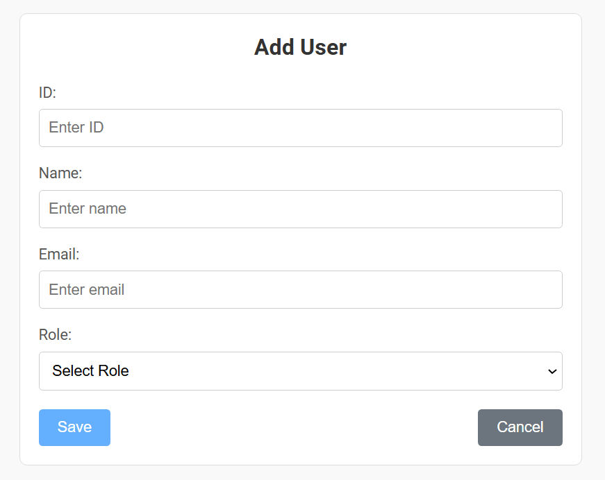
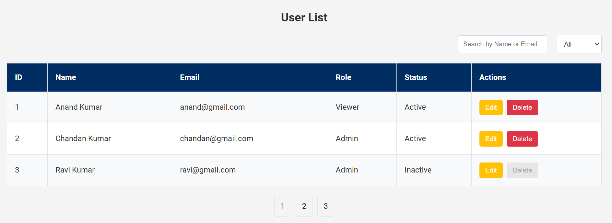

# Angular User Management System !

This project was generated with [Angular CLI](https://github.com/angular/angular-cli) version 18.2.6.

## Features Implemented

1. **Single Page Application with Multiple Components:**
   - Two main components created under the `pages` directory:
     - `add-form`: Handles both adding and editing users.
     - `OutPut`: 
     - `form-list`: Displays the list of users with search, filter, pagination, and sorting functionalities.
     - `See Output`:

2. **User List with Search and Filter Options:**
   - The `form-list` component allows users to search and filter the displayed list of users.

3. **Form for Adding and Editing Users:**
   - The `add-form` component provides a form to create or edit user details.
   - Includes validation for required fields and email format.

4. **Pagination and Sorting:**
   - Implemented in the `form-list` component for better user management.

5. **Home Page with Shared Components:**
   - A `home` page is created under the `app` directory.
   - A `shared` page contains two components:
     - `navbar`: Displays the navigation bar.
     - `footer`: Displays the footer.

## Development Server

Run `ng serve` for a dev server. Navigate to `http://localhost:4200/`. The application will automatically reload if you change any of the source files.

## Code Scaffolding

Run `ng generate component component-name` to generate a new component. You can also use `ng generate directive|pipe|service|class|guard|interface|enum|module`.

## Build

Run `ng build` to build the project. The build artifacts will be stored in the `dist/` directory.

## Running Unit Tests

Run `ng test` to execute the unit tests via [Karma](https://karma-runner.github.io).

## Running End-to-End Tests

Run `ng e2e` to execute the end-to-end tests via a platform of your choice. To use this command, you need to first add a package that implements end-to-end testing capabilities.

## Directory Structure

```
src/
  app/
    home/
      home.component.ts
      home.component.html
      home.component.css
    shared/
      navbar/
        navbar.component.ts
        navbar.component.html
        navbar.component.css
      footer/
        footer.component.ts
        footer.component.html
        footer.component.css
    pages/
      add-form/
        add-form.component.ts
        add-form.component.html
        add-form.component.css
      form-list/
        form-list.component.ts
        form-list.component.html
        form-list.component.css
```

## Further Help

To get more help on the Angular CLI use `ng help` or go check out the [Angular CLI Overview and Command Reference](https://angular.dev/tools/cli) page.
